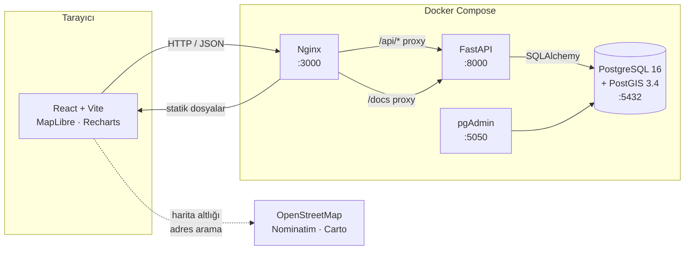

# 🌿 GreenAsset — Akıllı Şehir Varlık Yönetimi

Belediyelerin şehirdeki **ağaçlarını, park mobilyalarını, aydınlatma direklerini,
çöp kutularını ve oyun gruplarını** harita üzerinde takip ettiği, konum tabanlı
(GIS) varlık yönetim sistemi.

> ODAKENT Çevre & Bilişim A.Ş. — Staj Proje Ödevi 2

**Projenin özü:** Konum hesapları uygulama katmanında değil, **veritabanında**
yapılıyor. Bir varlığın hangi ilçeye ait olduğu elle girilmiyor; PostGIS
koordinata bakıp `ST_Within` ile kendisi buluyor. "Şu alanın içindekiler" veya
"500 metre yakınımdakiler" sorguları da aynı şekilde veritabanında çalışıyor.

---

## 🚀 Kurulum

**Tek gereksinim: Docker Desktop.** Python, Node.js veya PostgreSQL kurmanıza
gerek yok — hepsi konteynerlerin içinde.

```bash
git clone https://github.com/muffylamingo/GreenAsset-Staj.git
```

```bash
cd GreenAsset-Staj && cp .env.example .env
```

```bash
docker compose up -d
```

İlk açılış imajları indirip derlediği için 3-5 dakika sürer. Sonra veritabanını
demo verisiyle doldurun:

```bash
docker compose exec backend python -m app.seed --assets 1500 --reset
```

```bash
docker compose exec backend python -m app.seed_users
```

Hazır. Tarayıcıdan açın:

| Servis | Adres | Not |
|---|---|---|
| **Uygulama** | http://localhost:3000 | Nginx ile servis edilen React derlemesi |
| API dokümantasyonu | http://localhost:3000/docs | Swagger — uçları buradan deneyebilirsiniz |
| pgAdmin | http://localhost:5050 | Veritabanı yönetimi (sunucu bağlantısı hazır tanımlı) |

### Demo hesapları

| Kullanıcı | Parola | Rol | Yetki |
|---|---|---|---|
| `admin` | `admin123` | Yönetici | Her şey, **silme ve denetim kayıtları dahil** |
| `saha` | `saha123` | Saha ekibi | Ekleme, güncelleme, bakım kaydı — **silemez** |

> ⚠️ Parolaların burada ve giriş ekranında görünmesi bilinçlidir; bu bir staj
> demo projesidir. Gerçek bir kurulumda kullanıcılar yönetim panelinden
> oluşturulur ve parolalar paylaşılmaz.

### Durdurma ve temizleme

```bash
docker compose down
```

Veritabanını da silmek için (⚠️ tüm veri gider):

```bash
docker compose down -v
```

---

## 🏗️ Mimari



**Neden Nginx önde duruyor?** Tarayıcı her şeyi tek adresten (`:3000`) görüyor —
uygulama da, API de, dokümantasyon da. Bunun iki faydası var: CORS'a hiç gerek
kalmıyor ve backend'in portu dışarı hiç açılmasa bile sistem çalışıyor.

### Katmanlı mimari (backend)

```
api/      → HTTP'yi bilir      (route, doğrulama, yetki)
  ↓
crud/     → veritabanını bilir (sorgular, iş mantığı)
  ↓
models/   → tabloyu tanımlar   (SQLAlchemy)
```

API katmanı asla doğrudan SQL yazmaz. Bu sayede FastAPI'yi başka bir
framework ile değiştirsek CRUD katmanı aynen kalır.

---

## 🧱 Teknoloji — ne, neden

| Katman | Teknoloji | Neden seçildi |
|---|---|---|
| Veritabanı | **PostgreSQL 16 + PostGIS 3.4** | Mekansal sorgular için. `ST_Within`, `ST_DWithin` gibi işleri uygulama katmanında yazmak hem yavaş hem hataya açık olurdu |
| Backend | **FastAPI** | Swagger dokümantasyonunu kendisi üretiyor, doğrulama tip tanımından geliyor. Flask'ta ikisi de elle yazılırdı |
| ORM | **SQLAlchemy 2 + GeoAlchemy2** | GeoAlchemy2, SQLAlchemy'ye `Geometry` tipini ekliyor |
| Şema yönetimi | **Alembic** | Veritabanı değişiklikleri sürümlü ve geri alınabilir |
| Kimlik | **PyJWT + bcrypt** | Durumsuz oturum; bcrypt kasıtlı yavaş olduğu için kaba kuvvete dirençli |
| Hız sınırı | **slowapi** | Giriş ucunu kaba kuvvete karşı korur |
| Frontend | **React 19 + Vite** | Vite'ın anlık yenilemesi ve hızlı derlemesi |
| Yönlendirme | **React Router** | Adres çubuğu ile uygulama durumunu bağlar |
| Harita | **MapLibre GL JS v5** | Açık kaynak, **API anahtarı gerektirmiyor**. Mapbox ücretliye geçince çatallanan sürüm |
| Stil | **Tailwind CSS v4** | Tasarım token'ları CSS değişkeni olarak; tema değişimi tek yerden |
| Form | **React Hook Form + Zod** | Doğrulama şeması tek yerde, hata mesajları oradan geliyor |
| Sunucu verisi | **TanStack Query** | Önbellek, yeniden deneme, yükleniyor durumları |
| Grafik | **Recharts** | React bileşeni olarak grafikler |
| Çoklu dil | **react-i18next** | TR / EN, tercih kaydediliyor |
| Servis | **Docker Compose + Nginx** | Değerlendiren kişi tek komutla çalıştırabilsin |
| Test | **pytest** (61 test) | Kritik iş kuralları, özellikle yetki |
| Lint | **ruff** (Python) · **oxlint** (JS) | Hızlı, yapılandırması açık |

---

## ✨ Özellikler

### Ödevin istediği 5 aşama

<details>
<summary><b>1. Veritabanı ve Docker</b></summary>

- PostGIS eklentili PostgreSQL + pgAdmin, tek `docker compose up` ile
- `assets` tablosu: UUID, isim, tip (5 çeşit), durum, **Point geometrisi (SRID 4326)**, notlar, zaman damgaları
- Geometri üzerinde **GIST index** — mekansal sorguların hızlı olmasının sırrı
- Alembic ile şema versiyonlama (5 migration), `downgrade` çalışır durumda
- Healthcheck: backend, veritabanı hazır olmadan başlamıyor
- Migration'lar konteyner açılışında **otomatik** uygulanıyor
</details>

<details>
<summary><b>2. REST API</b></summary>

- `POST /assets` — koordinatla yeni varlık; **ilçe `ST_Within` ile otomatik atanır**
- `GET /assets` — **GeoJSON FeatureCollection** (`?format=json` ile düz liste)
- `PUT` / `DELETE` — güncelleme ve silme
- Filtreler: tip, durum, ilçe, metin arama (Türkçe uyumlu `unaccent`), **bbox**
- Sayfalama (`limit`/`offset`), sıralama, toplu işlemler
- `X-Total-Count` başlığı ile toplam kayıt sayısı
</details>

<details>
<summary><b>3. Frontend — form ve tablo</b></summary>

- React Hook Form + **Zod** doğrulaması
  - İsim boş olamaz (sadece boşluk girişi de reddedilir)
  - Enlem −90..90, boylam −180..180
  - **Virgüllü ondalık desteği**: `41,105` → `41.105` (Türkçe klavye)
- Sıralanabilir tablo, filtre chip'leri, toplu seçim, sayfalama
- Onay modalı, bildirim mesajları, boş/yükleniyor/hata ekranları
- **URL yönlendirmesi**: `/map`, `/assets`, `/dashboard` — yenileme aynı sayfada
  kalır, bağlantı paylaşılabilir, bilinmeyen adres için 404 sayfası
</details>

<details>
<summary><b>4. Harita entegrasyonu</b></summary>

- MapLibre GL JS, Carto altlık (tema ile birlikte açık/koyu değişir)
- **Kümeleme** — 1475 ayrı nokta yerine sayı balonları
- **Haritaya tıkla → form koordinatları otomatik dolar** (ödev şartı)
- Zoom'a bağlı gösterim: şehir ölçeğinde **renk = durum**, sokak ölçeğinde **ikon = tip**
- Harita açıklaması (legend), görüş alanına bağlı canlı sayaç
- Tablodan "haritada göster" → harita o noktaya uçuyor
</details>

<details>
<summary><b>5. Analiz ve raporlama</b></summary>

- Gösterge paneli: 4 KPI kartı + tip / durum / ilçe / zaman grafikleri
- **Haritada alan çiz → `ST_Within` → o alandaki varlıklar** (ödev şartı)
- CSV / GeoJSON dışa aktarım
  - CSV'de **UTF-8 BOM** ve `;` ayracı → Excel'de Türkçe karakterler doğru görünür
</details>

### Ödev dışı eklenenler

| Özellik | Ne işe yarıyor |
|---|---|
| 🔐 **Rol bazlı yetkilendirme** | JWT + bcrypt. Yönetici siler, saha ekibi silemez. Kontrol router seviyesinde |
| 📋 **Denetim izi** | Kim, ne zaman, neyi değiştirdi. **Varlık silinse bile kaydı kalır** |
| 🛡️ **Kaba kuvvet koruması** | Giriş ucunda dakikada 10 deneme sınırı |
| 🔧 **Bakım geçmişi** | `assets` ile 1-N ilişki, "X gündür bakılmadı" uyarısı |
| 📍 **Yakınımdakiler** | `ST_DWithin` ile konuma göre arama, metre cinsinden mesafe |
| 🔎 **Adres arama** | OpenStreetMap Nominatim, sonuç bulunamazsa kademeli kelime azaltma |
| 🗺️ **İlçe sınırları** | Gerçek OSM verisi (39 ilçe), varlık ilçesi otomatik hesaplanır |
| 🌍 **Çift dil** | Türkçe / İngilizce, tercih kaydedilir |
| 🌗 **Açık / koyu tema** | Harita altlığı da değişir |
| ⚙️ **CI** | Her push'ta test + lint + Docker derlemesi |

---

## 🔌 API Uçları

Tamamı Swagger'da denenebilir: **http://localhost:3000/docs**

| Metot | Yol | Açıklama |
|---|---|---|
| `POST` | `/api/v1/auth/login` | Giriş yap → JWT (dakikada 10 deneme sınırı) |
| `GET` | `/api/v1/auth/me` | Oturumdaki kullanıcı |
| `GET` | `/api/v1/assets` | Varlıkları listele (GeoJSON veya JSON) |
| `POST` | `/api/v1/assets` | Yeni varlık ekle |
| `GET` | `/api/v1/assets/{id}` | Tek varlık |
| `PUT` | `/api/v1/assets/{id}` | Güncelle |
| `DELETE` | `/api/v1/assets/{id}` | Sil — **yalnızca yönetici** |
| `PATCH` | `/api/v1/assets/bulk/status` | Toplu durum değiştir |
| `POST` | `/api/v1/assets/bulk/delete` | Toplu sil — **yalnızca yönetici** |
| `POST` | `/api/v1/assets/within` | **Poligon içindeki varlıklar** (`ST_Within`) |
| `GET` | `/api/v1/assets/nearby` | **Yakındaki varlıklar** (`ST_DWithin`) |
| `GET` | `/api/v1/assets/export` | CSV / GeoJSON dışa aktarım |
| `GET` | `/api/v1/assets/{id}/logs` | Varlığın bakım geçmişi |
| `POST` | `/api/v1/assets/{id}/logs` | Bakım kaydı ekle |
| `DELETE` | `/api/v1/maintenance/{id}` | Bakım kaydı sil |
| `GET` | `/api/v1/districts` | İlçe listesi |
| `GET` | `/api/v1/districts/geojson` | İlçe sınırları |
| `GET` | `/api/v1/stats/summary` | Gösterge paneli özeti |
| `GET` | `/api/v1/stats/timeseries` | Zamana göre eklenen varlıklar |
| `GET` | `/api/v1/audit` | Denetim kayıtları — **yalnızca yönetici** |
| `GET` | `/api/v1/audit/asset/{id}` | Bir varlığın geçmişi (silinmiş olsa bile) |
| `GET` | `/health` | Sağlık kontrolü (kimlik gerekmez) |

---

## 📂 Proje Yapısı — neyin ne işe yaradığı

```
├── docker-compose.yml          4 servis: db, pgadmin, backend, frontend
├── .env.example                Ortam değişkeni şablonu (.env buradan kopyalanır)
│
├── backend/
│   ├── Dockerfile              Python 3.12 imajı
│   ├── requirements.txt        Python bağımlılıkları
│   ├── ruff.toml               Lint kuralları (gerekçeleriyle)
│   ├── alembic/versions/       5 migration — şema geçmişi
│   ├── tests/                  61 pytest testi
│   │   ├── conftest.py         Test altyapısı: ayrı DB, işlem geri alma, fikstürler
│   │   ├── test_assets.py      CRUD, filtreler, GeoJSON biçimi
│   │   ├── test_auth.py        Giriş, token, rol kontrolü
│   │   ├── test_spatial.py     ST_Within, ST_DWithin
│   │   ├── test_maintenance.py Bakım kayıtları
│   │   ├── test_audit.py       Denetim izi
│   │   └── test_rate_limit.py  Kaba kuvvet koruması
│   └── app/
│       ├── main.py             Uygulama girişi, router sırası, middleware
│       ├── seed.py             Demo varlık üretimi
│       ├── seed_users.py       Demo kullanıcılar
│       ├── core/
│       │   ├── config.py       Ayarlar + üretim güvenlik kontrolü
│       │   ├── database.py     SQLAlchemy oturumu
│       │   ├── security.py     bcrypt özetleme, JWT üret/çöz
│       │   ├── deps.py         get_current_user, require_admin
│       │   ├── geo.py          Koordinat dönüşümü (tek kaynak)
│       │   └── limiter.py      Hız sınırı + proxy IP çözümleme
│       ├── models/             Tablolar: asset, district, maintenance, user, audit
│       ├── schemas/            Pydantic giriş/çıkış şemaları
│       ├── crud/               Veritabanı işlemleri
│       └── api/v1/             Uçlar (yukarıdaki tabloya karşılık gelir)
│
├── frontend/
│   ├── Dockerfile              Çok aşamalı: node ile derle → nginx ile servis et
│   ├── nginx.conf              SPA yönlendirmesi, /api ve /docs proxy, önbellek
│   ├── security-headers.conf   CSP ve güvenlik başlıkları
│   ├── vite.config.js          Derleme ve geliştirme sunucusu ayarları
│   └── src/
│       ├── main.jsx            Giriş noktası: Router, ErrorBoundary, Query
│       ├── App.jsx             İskelet: sol menü, rotalar, sağ panel
│       ├── api/                HTTP istemcisi ve uç fonksiyonları
│       ├── auth/               Oturum yönetimi ve token deposu
│       ├── hooks/              Veri çekme kancaları (useAssets, useStats…)
│       ├── i18n/               tr.json, en.json — 174 çeviri anahtarı
│       ├── theme/              Renk token'ları (tek kaynak)
│       └── components/
│           ├── map/            Harita, arama, yakındakiler, alan çizme, legend
│           ├── assets/         Tablo, form, bakım geçmişi, Zod şeması
│           ├── dashboard/      KPI kartları ve grafikler
│           ├── auth/           Giriş ekranı
│           └── ui/             Button, Modal, Icon, ErrorBoundary, NotFound
│
├── db/
│   ├── init/                   PostGIS eklentileri (ilk kurulumda çalışır)
│   ├── pgadmin/                pgAdmin sunucu tanımı
│   └── seed/
│       ├── fetch_districts.py  OSM'den ilçe sınırlarını indiren betik
│       └── istanbul_districts.geojson
│
├── .github/workflows/ci.yml    Her push'ta test + lint + Docker derlemesi
└── docs/design/                Tasarım referansı (Google Stitch çıktısı)
```

---

## 🧪 Testler

```bash
docker compose exec backend python -m pytest
```

```
61 passed
```

Testler ayrı bir veritabanında (`greenasset_test`) çalışır ve her test kendi
işleminde açılıp sonunda geri alınır — birbirlerini etkilemezler.

**Öne çıkan testler ve neyi koruduğu:**

| Test | Neyi koruyor |
|---|---|
| `test_saha_SILEMEZ_403` | Yetki kuralı bozulursa veri kaybı olur ve arayüzde hiçbir belirti vermez |
| `test_olmayan_kullanici_ayni_mesaji_doner` | Kullanıcı sayımı (enumeration) açığı |
| `test_geojson_koordinat_sirasi_lon_lat` | Sıra karışırsa noktalar okyanusta görünür |
| `test_ST_DWithin_yarıcap_metre_cinsinden` | `::geography` cast'i olmazsa 100 m → 100 derece olur |
| `test_silinen_varligin_izi_kalir` | Denetim izi, izlediği kaydın ömründen bağımsız olmalı |
| `test_login_kaba_kuvvete_kapali` | Sınır kalkarsa parola sınırsız denenebilir |
| `test_proxy_arkasinda_gercek_ip_kullanilir` | Yanlış IP okunursa hız sınırı tamamen atlanır |

### Sürekli entegrasyon (CI)

Her `push` ve pull request'te [GitHub Actions](.github/workflows/ci.yml) üç iş
çalıştırır:

| İş | Ne yapar |
|---|---|
| Backend | Geçici PostGIS ayağa kaldırır → 61 test → ruff lint |
| Frontend | `npm ci` → oxlint → üretim derlemesi |
| Docker | `docker compose build` — "tek komutla çalışır" iddiasını doğrular |

---

## 🔒 Güvenlik

Proje teslim öncesi denetimden geçirildi; bulgular tahminle değil **canlı istek
atarak** doğrulandı.

| Önlem | Ne yapıyor |
|---|---|
| **Rol bazlı yetki** | Kontrol router seviyesinde — yeni uç eklerken korumayı yazmayı unutmak mümkün değil, varsayılan kapalı |
| **Kaba kuvvet koruması** | `/auth/login` dakikada 10 deneme, aşılırsa `429`. Genel sınır 300/dk |
| **Denetim kaydı** | Kim, ne zaman, neyi değiştirdi — varlık silinse bile iz kalır. Yalnızca yönetici okuyabilir |
| **Güvenlik başlıkları** | CSP, `X-Frame-Options: DENY`, `nosniff`, `Referrer-Policy`, `Permissions-Policy` |
| **`SECRET_KEY` koruması** | `ENVIRONMENT=production` iken varsayılan anahtarla uygulama **hiç açılmaz** |
| **Kullanıcı sayımı engeli** | "Kullanıcı yok" ile "parola yanlış" aynı yanıtı döner |
| **Girdi doğrulama** | Sayfalama sınırı, geçersiz UUID, negatif değer → `422` |
| **Sürüm gizleme** | `server_tokens off` — Nginx sürümü sızmaz |
| **`robots.txt`** | İç araç olduğu için `Disallow: /` |

Referans: [OWASP API Security Top 10](https://owasp.org/API-Security/) — 1
numaralı madde *Broken Object Level Authorization* için özel test yazıldı.

---

## 🔍 Kayda Değer Teknik Kararlar

**İlçe bilgisi elle girilmiyor.** Kullanıcı koordinat veriyor, PostGIS
`ST_Within` ile hangi ilçeye düştüğünü kendisi buluyor. Sınırlar gerçek
OpenStreetMap verisi (39 ilçe) ve `db/seed/fetch_districts.py` ile tekrar
indirilebilir — kaynak belgeli ve üretilebilir.

**Denetim izi ayrı tabloda.** `assets` tablosuna `created_by` kolonu eklemek
asıl soruyu cevaplamaz: kayıt silinince o kolon da gider. Aynı sebeple
`entity_id` bilerek ForeignKey **değil** — FK olsaydı ya silme engellenirdi ya
da CASCADE ile iz de silinirdi.

**Yetki kontrolü router seviyesinde.** Tek tek uçlara değil router'a bağlı;
yeni bir uç eklendiğinde korumayı yazmayı unutmak mümkün değil.

**Rol her istekte veritabanından okunuyor**, token'dan değil. Token 12 saat
geçerli ve o sürede kullanıcının yetkisi düşürülmüş olabilir.

**N+1 önlendi.** "Son bakım tarihi" `column_property` + alt sorgu ile ana
sorguya gömüldü; 25 varlık için 26 değil **1 sorgu** atılıyor.

**Renk körlüğü doğrulaması.** Koyu tema durum paleti otomatik doğrulayıcıdan
geçirildi ve **reddedildi**: protanopi altında yeşil↔amber farkı ΔE 7.3 idi
(eşik 8) — kırmızı-yeşil renk körü biri "İyi" ile "Bakım Lazım"ı ayırt
edemeyecekti. Yeşil koyulaştırılıp amber açılarak ΔE 17.5'e çıkarıldı. Ayrıca
renk hiçbir yerde tek başına bilgi taşımıyor, her zaman metinle birlikte.

**İkon optimizasyonu.** Material Symbols değişken fontu 3.96 MB (7792 ikon);
kullanılan 35 ikon satır içi SVG olarak ~8 KB.

**Çok aşamalı Docker.** Node imajı ~400 MB (derleyici + `node_modules`), Nginx
~50 MB. Üretimde derleyici gerekmiyor.

---

## ⚠️ Bilinen Sınırlamalar

Bunlar bilinçli ödünlerdir; hangisinin neden bırakıldığı aşağıda yazılı.

### Güvenlik

- **Token `localStorage`'da tutuluyor.** XSS'e karşı korumasız; daha güvenlisi
  `HttpOnly` çerezdir. CSP bu riski azaltır ama sıfırlamaz. Bu projede
  basitlik için seçildi.
- **Demo parolaları giriş ekranında görünüyor.** Staj demosu olduğu için.
- **Swagger üretimde açık.** Gerçek bir kurulumda `docs_url=None` ile
  kapatılmalı — açık dokümantasyon saldırgana bütün uç haritasını verir.
  Burada açık çünkü ödev değerlendirmesi Swagger üzerinden yapılıyor.
- **HSTS kapalı.** Kurulum HTTP üzerinden çalışıyor; HTTPS'e geçilince
  `security-headers.conf` içindeki satır açılmalı.
- **Hız sınırı sayacı bellekte.** Tek kopya için yeterli; birden fazla kopya
  çalıştırılırsa Redis'e taşınmalı, yoksa gerçek sınır kopya sayısıyla çarpılır.

### Veri ve tutarlılık

- **Denetim kaydı ile işlem ayrı commit'lerde.** Tam atomiklik için `commit`
  çağrılarının CRUD katmanından API katmanına taşınması gerekir.
- **Yedekleme planı yok.** `docker compose down -v` tüm veriyi siler. Gerçek
  kurulumda düzenli `pg_dump` ve **geri yükleme provası** gerekir.

### Test ve kalite

- **`export`, `stats` ve `districts` uçlarının testi yok.** Diğer altı uç grubu
  test edilmiş durumda. Bu üçünde bir hata olursa CI yakalamaz.
- **Frontend testi yok.** Sadece lint ve derleme kontrolü var; bileşen testi
  (Vitest / Testing Library) eklenmedi.

### Arayüz

- **Mobil uyumluluk sınırlı.** Yerleşim masaüstü için tasarlandı; küçük
  ekranlarda sağ panel tam ekran açılıyor ama harita araçları dar geliyor.
- **Ekran görüntüsü / GIF yok.** Depoyu inceleyen kişi uygulamayı çalıştırmadan
  göremiyor.

---

## 🛠️ Geliştirme

Docker'daki frontend derlenmiş sürümdür; geliştirirken anlık yenilemeli
dev sunucusu daha rahat:

```bash
npm --prefix frontend install
```

```bash
npm --prefix frontend run dev
```

`http://localhost:5173` — Docker sürümüyle (3000) çakışmaz.

Logları izle:

```bash
docker compose logs -f backend
```

Veritabanına bağlan:

```bash
docker compose exec db psql -U greenasset -d greenasset
```

Model değiştirdikten sonra yeni migration:

```bash
docker compose exec backend alembic revision --autogenerate -m "aciklama"
```

> ⚠️ Otomatik üretilen migration'ı **her zaman** elden geçirin; alakasız
> değişiklikler önerebiliyor.

Lint:

```bash
docker compose exec backend ruff check .
```

```bash
npm --prefix frontend run lint
```

---

## 📖 Dokümantasyon

| Dosya | İçerik |
|---|---|
| [BILMEM-GEREKENLER.md](BILMEM-GEREKENLER.md) | Öğrenme rehberi: PostGIS, JWT, güvenlik, React tuzakları, bu projede karşılaşılan hatalar |
| [PLAN.md](PLAN.md) | Yol haritası, mimari kararlar, API sözleşmesi |
| [PROGRESS.md](PROGRESS.md) | İlerleme durumu ve teknik borç |
| [DESIGN-SYSTEM.md](DESIGN-SYSTEM.md) | Tasarım token'ları ve renk kararları |
| [EKSTRA-OZELLIKLER.md](EKSTRA-OZELLIKLER.md) | Ödev dışı geliştirme fikirleri |

---

## 📜 Veri Kaynakları ve Lisanslar

- İlçe sınırları ve harita altlığı: **© OpenStreetMap katkıda bulunanları** (ODbL)
- Adres arama: **OpenStreetMap Nominatim**
- Harita stilleri: **CARTO**
- İkonlar: **Material Symbols** (Apache 2.0), satır içi SVG olarak gömülü
- Yazı tipleri: **Plus Jakarta Sans**, **JetBrains Mono** (SIL Open Font License)
