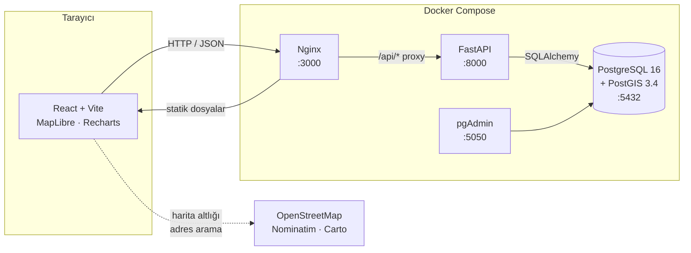

# 🌿 GreenAsset — Akıllı Şehir Varlık Yönetimi

Belediyelerin şehirdeki **ağaçlarını, park mobilyalarını, aydınlatma direklerini,
çöp kutularını ve oyun gruplarını** harita üzerinde takip ettiği, konum tabanlı
(GIS) varlık yönetim sistemi.

> ODAKENT Çevre & Bilişim A.Ş. — Staj Proje Ödevi 2

---

## 🚀 Tek komutla çalıştır

```bash
docker compose up -d
```

Sonra veritabanını demo verisiyle doldur:

```bash
docker compose exec backend python -m app.seed --assets 1500 --reset
```

Kullanıcıları oluştur:

```bash
docker compose exec backend python -m app.seed_users
```

Hepsi bu. Node.js veya Python kurmana gerek yok.

| Servis | Adres | Not |
|---|---|---|
| **Uygulama** | http://localhost:3000 | Nginx ile servis edilen React derlemesi |
| API dokümantasyonu | http://localhost:3000/docs | Swagger — uçları buradan deneyebilirsin |
| pgAdmin | http://localhost:5050 | Veritabanı yönetimi |

### Demo hesapları

| Kullanıcı | Parola | Rol | Yetki |
|---|---|---|---|
| `admin` | `admin123` | Yönetici | Her şey, **silme dahil** |
| `saha` | `saha123` | Saha ekibi | Ekleme, güncelleme, bakım kaydı — **silemez** |

> ⚠️ Parolaların burada ve giriş ekranında görünmesi bilinçlidir; bu bir staj
> demo projesidir. Gerçek bir kurulumda kullanıcılar yönetim panelinden
> oluşturulur ve parolalar paylaşılmaz.

---

## 🏗️ Mimari



### Katmanlı mimari (backend)

```
api/      → HTTP'yi bilir      (route, doğrulama, yetki)
  ↓
crud/     → veritabanını bilir (sorgular, iş mantığı)
  ↓
models/   → tabloyu tanımlar   (SQLAlchemy)
```

API katmanı asla doğrudan SQL yazmaz. Bu sayede FastAPI'yi başka bir
framework ile değiştirsek CRUD katmanı aynen kalır.

---

## 🧱 Teknoloji

| Katman | Teknoloji |
|---|---|
| Frontend | React 19 · Vite · React Router · Tailwind CSS v4 · MapLibre GL JS v5 |
| Form / veri | React Hook Form · Zod · TanStack Query · Axios |
| Grafik | Recharts |
| Çoklu dil | react-i18next (TR / EN) |
| Backend | Python 3.12 · FastAPI · SQLAlchemy 2 · GeoAlchemy2 · Alembic |
| Kimlik | PyJWT · bcrypt |
| Veritabanı | PostgreSQL 16 + PostGIS 3.4 |
| Servis | Docker Compose · Nginx · pgAdmin |
| Test | pytest (61 test) |

---

## ✨ Özellikler

### Ödevin istediği 5 aşama

<details>
<summary><b>1. Veritabanı ve Docker</b></summary>

- PostGIS eklentili PostgreSQL + pgAdmin, tek `docker compose up` ile
- `assets` tablosu: UUID, isim, tip (5 çeşit), durum, **Point geometrisi (SRID 4326)**
- Geometri üzerinde **GIST index** — mekansal sorguların hızlı olmasının sırrı
- Alembic ile şema versiyonlama (5 migration)
- Healthcheck: backend, DB hazır olmadan başlamıyor
</details>

<details>
<summary><b>2. REST API</b></summary>

- `POST /assets` — koordinatla yeni varlık; **ilçe `ST_Within` ile otomatik atanır**
- `GET /assets` — **GeoJSON FeatureCollection** (`?format=json` ile düz liste)
- `PUT` / `DELETE` — güncelleme ve silme
- Filtreler: tip, durum, ilçe, metin arama (Türkçe uyumlu `unaccent`), **bbox**
- Sayfalama, sıralama, toplu işlemler
</details>

<details>
<summary><b>3. Frontend — form ve tablo</b></summary>

- React Hook Form + **Zod** doğrulaması
  - İsim boş olamaz (sadece boşluk girişi de reddedilir)
  - Enlem −90..90, boylam −180..180
  - **Virgüllü ondalık desteği**: `41,105` → `41.105` (Türkçe klavye)
- Sıralanabilir tablo, filtre chip'leri, toplu seçim, sayfalama
- Onay modalı, toast bildirimleri, boş/yükleniyor/hata ekranları
- **URL yönlendirmesi**: `/harita`, `/varliklar`, `/panel` — yenileme aynı
  sayfada kalır, bağlantı paylaşılabilir, bilinmeyen adres için 404 sayfası
</details>

<details>
<summary><b>4. Harita entegrasyonu</b></summary>

- MapLibre GL JS, Carto altlık (tema ile birlikte açık/koyu değişir)
- **Kümeleme** — 1475 nokta yerine sayı balonları
- **Haritaya tıkla → form koordinatları otomatik dolar** (ödev şartı)
- Zoom'a bağlı gösterim: şehir ölçeğinde renk = durum, sokak ölçeğinde ikon = tip
- Legend, bbox'a bağlı canlı sayaç, tablo ↔ harita bağlantısı
</details>

<details>
<summary><b>5. Analiz ve raporlama</b></summary>

- Dashboard: 4 KPI kartı + tip/durum/ilçe/zaman grafikleri
- **Haritada alan çiz → `ST_Within` → o alandaki varlıklar** (ödev şartı)
- CSV / GeoJSON dışa aktarım (CSV'de UTF-8 BOM, Excel'de Türkçe doğru görünür)
</details>

### Ödev dışı eklenenler

| Özellik | Açıklama |
|---|---|
| 🔐 **Rol bazlı yetkilendirme** | JWT + bcrypt. Admin siler, saha ekibi silemez |
| 🔧 **Bakım geçmişi** | `assets` ile 1-N ilişki, "X gündür bakılmadı" uyarısı |
| 📍 **Yakınımdakiler** | `ST_DWithin` ile konuma göre arama, metre cinsinden mesafe |
| 🔎 **Adres arama** | OpenStreetMap Nominatim, kademeli kelime azaltma |
| 🗺️ **İlçe sınırları** | Gerçek OSM verisi (39 ilçe), varlık ilçesi otomatik hesaplanır |
| 🌍 **Çift dil** | Türkçe / İngilizce, tercih kaydedilir |
| 🌗 **Açık / koyu tema** | Harita altlığı da değişir |
| ✅ **61 test** | Yetki kuralları, mekansal sorgular, doğrulama |

---

## 🧪 Testler

```bash
docker compose exec backend python -m pytest
```

```
61 passed in ~50s
```

Testler ayrı bir veritabanında (`greenasset_test`) çalışır ve her test
kendi işleminde açılıp sonunda geri alınır — birbirlerini etkilemezler.

**Öne çıkan testler:**

| Test | Neyi koruyor |
|---|---|
| `test_saha_SILEMEZ_403` | Yetki kuralı bozulursa veri kaybı olur |
| `test_olmayan_kullanici_ayni_mesaji_doner` | Kullanıcı sayımı (enumeration) açığı |
| `test_geojson_koordinat_sirasi_lon_lat` | Sıra karışırsa noktalar okyanusta görünür |
| `test_ST_DWithin_yarıcap_metre_cinsinden` | `::geography` cast'i olmazsa 100 m → 100 derece |
| `test_silinen_varligin_izi_kalir` | Denetim izi, izlediği kaydın ömründen bağımsız olmalı |
| `test_login_kaba_kuvvete_kapali` | Sınır kalkarsa parola sınırsız denenebilir |
| `test_proxy_arkasinda_gercek_ip_kullanilir` | Yanlış IP okunursa rate limit tamamen atlanır |

---

## 🛠️ Geliştirme

Docker'daki frontend derlenmiş sürümdür; geliştirirken anlık yenilemeli
dev sunucusu daha rahat:

```bash
npm --prefix frontend run dev
```

`http://localhost:5173` — Docker sürümüyle (3000) çakışmaz.

Logları izle:

```bash
docker compose logs -f backend
```

Veritabanına bağlan:

```bash
docker compose exec db psql -U greenasset -d greenasset
```

Model değiştirdikten sonra yeni migration:

```bash
docker compose exec backend alembic revision --autogenerate -m "aciklama"
docker compose exec backend alembic upgrade head
```

Her şeyi sıfırla (⚠️ veri gider):

```bash
docker compose down -v
```

---

## 📂 Proje Yapısı

```
├── docker-compose.yml        # 4 servis: db, pgadmin, backend, frontend
├── backend/
│   ├── alembic/versions/     # 5 migration
│   ├── tests/                # 61 pytest testi
│   └── app/
│       ├── api/v1/           # uçlar: assets, spatial, stats, auth, maintenance
│       ├── core/             # ayarlar, DB, güvenlik, bağımlılıklar, geo
│       ├── crud/             # veritabanı işlemleri
│       ├── models/           # SQLAlchemy tabloları
│       └── schemas/          # Pydantic giriş/çıkış şemaları
├── frontend/
│   ├── Dockerfile            # çok aşamalı: node build → nginx
│   ├── nginx.conf            # SPA yönlendirmesi + /api proxy
│   └── src/
│       ├── api/              # HTTP istemcisi ve uç fonksiyonları
│       ├── auth/             # oturum yönetimi
│       ├── components/       # assets, map, dashboard, ui, auth
│       ├── hooks/            # React Query hook'ları
│       ├── i18n/             # tr.json, en.json
│       └── theme/            # renk token'ları (tek kaynak)
├── db/
│   ├── init/                 # PostGIS eklentileri
│   └── seed/                 # OSM'den ilçe sınırı indiren script
└── docs/design/              # tasarım referansı (Google Stitch export'u)
```

---

## 📖 Dokümantasyon

| Dosya | İçerik |
|---|---|
| [PROGRESS.md](PROGRESS.md) | İlerleme durumu, kalan işler, teknik borç |
| [PLAN.md](PLAN.md) | Yol haritası, mimari kararlar, API sözleşmesi |
| [BILMEM-GEREKENLER.md](BILMEM-GEREKENLER.md) | Öğrenme rehberi: PostGIS, JWT, React tuzakları, sık hatalar |
| [DESIGN-SYSTEM.md](DESIGN-SYSTEM.md) | Tasarım token'ları ve renk kararları |
| [EKSTRA-OZELLIKLER.md](EKSTRA-OZELLIKLER.md) | Ödev dışı geliştirme fikirleri |

---

## 🔍 Kayda Değer Teknik Kararlar

**İlçe bilgisi elle girilmiyor.** Kullanıcı koordinat veriyor, PostGIS
`ST_Within` ile hangi ilçeye düştüğünü kendisi buluyor. Sınırlar gerçek
OpenStreetMap verisi (39 ilçe).

**Renk körlüğü doğrulaması.** Koyu tema durum paleti otomatik doğrulayıcıdan
geçirildi ve **reddedildi**: protanopi altında yeşil↔amber farkı ΔE 7.3 idi
(eşik 8) — kırmızı-yeşil renk körü biri "İyi" ile "Bakım Lazım"ı ayırt
edemeyecekti. Yeşil koyulaştırılıp amber açılarak ΔE 17.5'e çıkarıldı.
Ayrıca renk hiçbir yerde tek başına bilgi taşımıyor, her zaman metinle birlikte.

**İkon optimizasyonu.** Material Symbols variable fontu 7792 ikon içeriyor ve
**3.96 MB**. Kullanılan 35 ikon tek tek SVG olarak inline edildi — **~8 KB**.

**Yetki kontrolü router seviyesinde.** Tek tek uçlara değil router'a bağlı;
yeni bir uç eklendiğinde korumayı yazmayı unutmak mümkün değil.

**N+1 sorgusu önlendi.** "Son bakım tarihi" `column_property` + alt sorgu ile
ana sorguya gömüldü; 25 varlık için 26 değil 1 sorgu atılıyor.

---

## 🔒 Güvenlik

Proje teslim öncesi denetimden geçirildi; bulunan açıklar kapatıldı.

| Önlem | Ne yapıyor |
|---|---|
| **Rol bazlı yetki** | Yetki kontrolü router seviyesinde — yeni uç eklerken korumayı yazmayı unutmak mümkün değil. Saha ekibi silemez (`403`). |
| **Kaba kuvvet koruması** | `/auth/login` dakikada 10 deneme, aşılırsa `429`. Genel sınır 300/dk. |
| **Denetim kaydı** | Kim, ne zaman, neyi değiştirdi — **varlık silinse bile iz kalır**. Yalnızca yönetici okuyabilir. |
| **Güvenlik başlıkları** | CSP, `X-Frame-Options: DENY`, `nosniff`, `Referrer-Policy`, `Permissions-Policy`. |
| **`SECRET_KEY` koruması** | `ENVIRONMENT=production` iken varsayılan anahtarla uygulama **hiç açılmaz**. |
| **Kullanıcı sayımı engeli** | "Kullanıcı yok" ile "parola yanlış" aynı yanıtı döner. |
| **Girdi doğrulama** | Sayfalama sınırı, geçersiz UUID, negatif değer → `422`. |
| **Sürüm gizleme** | `server_tokens off` — Nginx sürümü sızmaz. |
| **`robots.txt`** | İç araç olduğu için `Disallow: /`. |

Referans: [OWASP API Security Top 10](https://owasp.org/API-Security/) — 1 numaralı
madde olan *Broken Object Level Authorization* için özel test yazıldı.

---

## ⚠️ Bilinen Sınırlamalar

Bunlar bilinçli ödünlerdir, teslim notudur:

- **Token `localStorage`'da tutuluyor.** XSS'e karşı korumasız; üretimde
  HttpOnly cookie tercih edilmeli. (CSP bu riski azaltır ama sıfırlamaz.)
- **Demo parolaları giriş ekranında görünüyor.** Staj projesi olduğu için.
- **Rate limit sayacı bellekte.** Tek kopya için yeterli; birden fazla kopya
  çalıştırılırsa Redis'e taşınmalı.
- **Denetim kaydı ile işlem ayrı commit'lerde.** Tam atomiklik için `commit`
  çağrılarının CRUD katmanından API katmanına taşınması gerekir.
- **HSTS kapalı.** Kurulum HTTP üzerinden çalışıyor; HTTPS'e geçilince
  `security-headers.conf` içindeki satır açılmalı.
- **CI kurulmadı.** 61 test var ama GitHub Actions ile otomatik çalışmıyor.

---

## 📜 Veri Kaynakları

- İlçe sınırları ve harita altlığı: **© OpenStreetMap katkıda bulunanları** (ODbL)
- Adres arama: **OpenStreetMap Nominatim**
- Harita stilleri: **CARTO**
